## Hi there, I'm mengyuan liu 👋

- 🔭 I’m currently a student at the university of Glasgow.
- 🧰 I'm working with Python, radar, and machine learning.

  

  
  

<!--
**triagram/Triagram** is a ✨ _special_ ✨ repository because its `README.md` (this file) appears on your GitHub profile.

Here are some ideas to get you started:

- 🔭 I’m currently a student at the university of Glasgow.
- 🌱 I’m currently learning ...
- 👯 I’m looking to collaborate on ...
- 🤔 I’m looking for help with ...
- 💬 Ask me about ...
- 📫 How to reach me: ...
- 😄 Pronouns: ...
- ⚡ Fun fact: ...

> old-fashioned
-->
